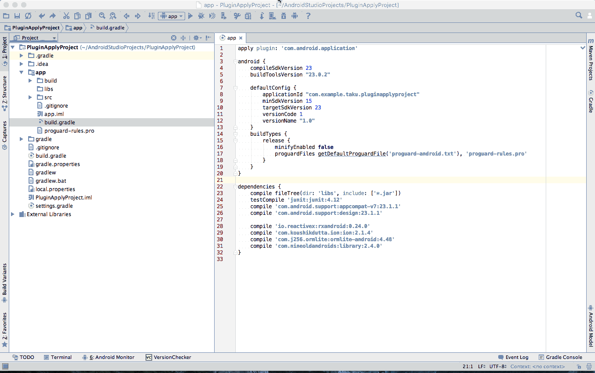

# Dependencies Version Checker
## What's this?
Dependencies Version Checker is an Intellij Plugin.
This plugin provides the bottom tool window 
which extract library declaration from your 'build.gradle' script and
show latest library versions searched in Maven Repository.

[JetBrains Plugin Repository :: Dependencies Version Checker](https://plugins.jetbrains.com/plugin/8147?pr=)

## How to use?

## Future works
- [x] Report library versions declared in your 'build.gradle'.
- [x] Check google and android library versions from your local repository.
